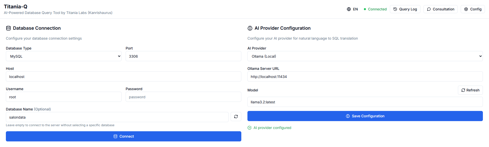
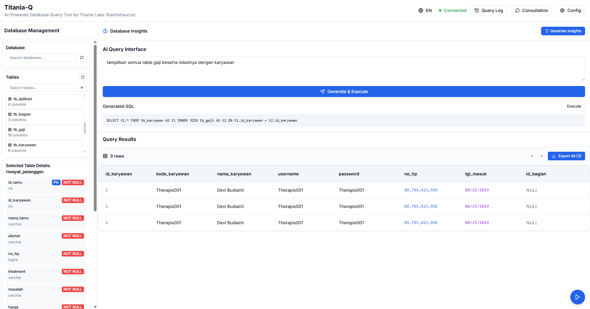
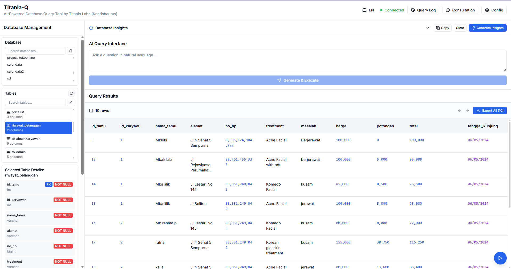
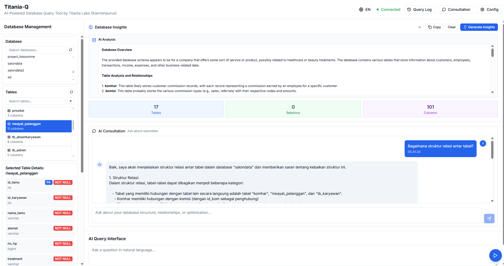

# Titania-Q 🚀

**Alat manajemen database bertenaga AI dengan aplikasi desktop Tauri**

<div align="center">
  
  <p><em>Terhubung ke berbagai jenis database dengan mudah</em></p>
</div>

Titania-Q adalah aplikasi desktop modern yang berdiri sendiri, dibangun dengan Tauri, Next.js, dan integrasi AI untuk manajemen database yang komprehensif. Aplikasi ini menyediakan antarmuka yang intuitif untuk operasi database, generasi SQL bertenaga AI, dan diagram relasi database visual.

## 🌟 Mengapa Titania-Q?

Sebagai **proyek open-source**, Titania-Q bertujuan untuk mendemokratisasi manajemen database dengan membuat alat bertenaga AI dapat diakses oleh semua orang. Baik Anda seorang developer, analis data, atau administrator database, Titania-Q menyederhanakan operasi database yang kompleks melalui pemrosesan bahasa alami dan antarmuka visual.

**Misi Kami**: Membantu developer dan profesional database bekerja lebih efisien dengan menggabungkan kekuatan AI dengan antarmuka pengguna yang intuitif, membuat manajemen database dapat diakses oleh semua orang terlepas dari latar belakang teknis mereka.

## ✨ Fitur

### 🆕 Yang Baru di v0.2.0

- **🚀 Aplikasi Standalone** - Tidak memerlukan dependensi eksternal
- **🤖 Implementasi AI Rust** - Pemrosesan AI yang lebih cepat dan andal
- **🔧 Dukungan Anthropic Claude** - Integrasi penuh dengan model Claude
- **📝 Pencatatan Query** - Melacak semua query yang dibuat AI dan manual
- **⚡ Performa yang Ditingkatkan** - Panggilan HTTP langsung tanpa overhead Next.js
- **📦 Bundle Lebih Kecil** - Ukuran berkurang dengan menghapus dependensi yang tidak digunakan

### 🎯 Generasi SQL Bertenaga AI

<div align="center">
  
  <p><em>Buat query SQL menggunakan bahasa alami dengan berbagai penyedia AI</em></p>
</div>

- Buat query SQL kompleks menggunakan bahasa alami
- Dukungan untuk berbagai penyedia AI (OpenAI, Google Gemini, Anthropic Claude, Ollama)
- Generasi query yang sadar konteks berdasarkan skema database Anda
- Validasi query dan saran optimasi

### 📊 Manajemen Database Komprehensif

<div align="center">
  
  <p><em>Lihat dan kelola tabel database Anda dengan fitur canggih</em></p>
</div>

- Terhubung ke MySQL, PostgreSQL, SQLite, dan MongoDB
- Analisis skema database real-time
- Penelusuran tabel interaktif dengan paginasi
- Kemampuan filtering dan pencarian data canggih
- Pencatatan dan pelacakan riwayat query

### 🔍 Diagram Database Visual

- Visualisasi relasi database yang dibuat AI
- Diagram Mermaid interaktif
- Pembaruan skema real-time

### 💬 Konsultasi AI

<div align="center">
  
  <p><em>Dapatkan wawasan bertenaga AI tentang struktur dan data database Anda</em></p>
</div>

- Ajukan pertanyaan tentang struktur database Anda
- Dapatkan rekomendasi untuk optimasi database
- Pahami relasi kompleks antar tabel
- Terima saran untuk perbaikan query

### 🌍 Dukungan Multi-bahasa

- Antarmuka bahasa Inggris dan Indonesia
- Pesan error dan tooltip yang dilokalisasi
- Pergantian bahasa yang mudah

### 🖥️ Aplikasi Desktop Standalone

- Tidak memerlukan server, berjalan natively di Windows
- Performa ringan dan cepat
- Kemampuan offline untuk database lokal
- Pembaruan otomatis

### ⚡ Fitur Canggih

- Pencatatan dan pelacakan riwayat query
- Wawasan dan analitik database
- Generasi query bertenaga AI
- Aplikasi standalone (tanpa dependensi eksternal)

## 🛠️ Tech Stack

- **Frontend**: Next.js 14, React 18, TypeScript, Tailwind CSS
- **Desktop**: Tauri 1.8 (berbasis Rust)
- **Backend**: Rust dengan SQLx, MongoDB Rust Driver
- **Integrasi AI**: Layanan AI berbasis Rust dengan berbagai penyedia
- **Dukungan Database**: MySQL, PostgreSQL, SQLite, MongoDB
- **Komponen UI**: Komponen kustom dengan ikon Lucide React

## 🚀 Memulai

### Prasyarat

- Windows 10/11 (64-bit)
- Node.js 18+ (untuk development)
- Rust 1.70+ (untuk development)
- Server database (MySQL, PostgreSQL, SQLite, atau MongoDB)

### Mulai Cepat (Download)

1. **Download release terbaru**

   - Pergi ke [Releases](https://github.com/brillianodhiya/titania-q/releases)
   - Download `Titania-Q_0.2.0_x64_en-US.msi` (Windows Installer)
   - Atau download `Titania-Q_0.2.0_x64-setup.exe` (Setup Portable)

2. **Install dan jalankan**
   - Jalankan installer
   - Luncurkan Titania-Q dari desktop atau start menu
   - Tidak diperlukan setup tambahan!

### Setup Development

1. **Clone repository**

   ```bash
   git clone https://github.com/brillianodhiya/titania-q.git
   cd titania-q
   ```

2. **Install dependencies**

   ```bash
   npm install
   ```

3. **Jalankan dalam mode development**

   ```bash
   npm run tauri:dev
   ```

4. **Build untuk production**
   ```bash
   npm run tauri:build
   ```

## 📖 Panduan Penggunaan

### 1. Koneksi Database

1. Buka aplikasi
2. Navigasi ke Panel Manajemen Database
3. Pilih jenis database Anda (MySQL, PostgreSQL, SQLite, MongoDB)
4. Masukkan detail koneksi Anda
5. Klik "Connect" untuk membangun koneksi

### 2. Konfigurasi AI

1. Pergi ke Pengaturan Penyedia AI
2. Pilih penyedia AI pilihan Anda:
   - **OpenAI**: GPT-4o, GPT-4o-mini, GPT-4-turbo, GPT-3.5-turbo
   - **Google Gemini**: gemini-1.5-pro, gemini-1.5-flash, gemini-1.0-pro
   - **Anthropic Claude**: claude-3-5-sonnet, claude-3-5-haiku, claude-3-opus
   - **Ollama**: Model lokal (llama2, codellama, mistral, dll.)
3. Masukkan API key Anda (untuk OpenAI, Gemini, dan Anthropic)
4. Pilih model dari dropdown
5. Simpan konfigurasi

### 3. Generasi SQL

1. Gunakan Antarmuka Query AI
2. Ketik permintaan Anda dalam bahasa alami (contoh: "Tampilkan semua pengguna yang mendaftar bulan lalu")
3. Tinjau SQL yang dihasilkan
4. Jalankan query dan lihat hasilnya

### 4. Visualisasi Database

1. Navigasi ke Database Insights
2. Klik "Generate Diagram" untuk membuat relasi visual
3. Gunakan zoom dan pan untuk menjelajahi diagram
4. Export diagram jika diperlukan

## ⚙️ Konfigurasi

### Penyedia AI

- **OpenAI**: GPT-4o, GPT-4o-mini, GPT-4-turbo, GPT-3.5-turbo
- **Google Gemini**: gemini-1.5-pro, gemini-1.5-flash, gemini-1.0-pro
- **Anthropic Claude**: claude-3-5-sonnet, claude-3-5-haiku, claude-3-opus
- **Ollama**: Model lokal (llama2, codellama, mistral, dll.)

### Dukungan Database

- **MySQL**: Dukungan penuh dengan analisis skema dan deteksi relasi
- **PostgreSQL**: Dukungan penuh dengan tipe data canggih
- **SQLite**: Dukungan database lokal dengan penyimpanan berbasis file
- **MongoDB**: Dukungan database dokumen dengan analisis koleksi

## 📁 Struktur Proyek

```
titania-q/
├── src/                    # Frontend Next.js
│   ├── app/               # Halaman app router
│   ├── components/        # Komponen React
│   ├── hooks/             # Custom React hooks
│   ├── lib/               # Library utilitas
│   └── types/             # Definisi TypeScript
├── src-tauri/            # Backend Tauri
│   ├── src/              # Kode sumber Rust
│   ├── icons/            # Ikon aplikasi
│   └── tauri.conf.json   # Konfigurasi Tauri
├── screenshot/           # Screenshot aplikasi
├── package.json          # Dependencies Node.js
└── README.md            # File ini
```

## 🤝 Berkontribusi

Kami menyambut kontribusi dari komunitas! Berikut cara Anda dapat membantu:

1. **Fork repository**
2. **Buat feature branch** (`git checkout -b feature/fitur-menakjubkan`)
3. **Buat perubahan Anda** dan test dengan teliti
4. **Commit perubahan Anda** (`git commit -m 'Tambah fitur menakjubkan'`)
5. **Push ke branch** (`git push origin feature/fitur-menakjubkan`)
6. **Buka Pull Request**

### Panduan Development

- Ikuti best practices TypeScript
- Tulis commit message yang bermakna
- Tambahkan test untuk fitur baru
- Update dokumentasi sesuai kebutuhan
- Ikuti style kode yang ada

## 💖 Dukung Proyek

Titania-Q adalah proyek open-source yang dikembangkan dengan ❤️ untuk membantu komunitas developer. Jika Anda merasa proyek ini berguna, pertimbangkan untuk mendukung pengembangannya:

### ☕ Beli Saya Kopi

Dukungan Anda membantu kami:

- Memelihara dan meningkatkan aplikasi
- Menambah fitur baru dan dukungan database
- Menyediakan dokumentasi dan tutorial yang lebih baik
- Menjaga proyek tetap gratis dan open-source

**Link Donasi:**

- 🇮🇩 [Saweria](https://saweria.co/KanrishaB) - Dukungan via Saweria
- 🇮🇩 [Trakteer](https://trakteer.id/kanrisha-d) - Dukungan via Trakteer

### ⭐ Bintang Repository

Jika Anda tidak bisa berkontribusi secara finansial, memberikan bintang pada repository membantu kami menjangkau lebih banyak developer yang mungkin mendapat manfaat dari alat ini.

## 📄 Lisensi

Proyek ini dilisensikan di bawah Apache License 2.0 - lihat file [LICENSE](LICENSE) untuk detail.

## 🙏 Ucapan Terima Kasih

- [Tauri](https://tauri.app/) - Framework aplikasi desktop
- [Next.js](https://nextjs.org/) - Framework React
- [Rust HTTP Client](https://docs.rs/reqwest/) - Integrasi AI
- [Tailwind CSS](https://tailwindcss.com/) - Framework styling
- [Lucide React](https://lucide.dev/) - Ikon yang indah
- [Mermaid.js](https://mermaid.js.org/) - Generasi diagram

### Ucapan Terima Kasih Khusus

- [@zulfaah](https://github.com/zulfaah) - Istri tercinta saya, untuk dukungan dan bantuan berkelanjutan sepanjang pengembangan proyek ini

## 📞 Dukungan & Komunitas

Jika Anda mengalami masalah atau memiliki pertanyaan:

1. **Periksa halaman [Issues](https://github.com/brillianodhiya/titania-q/issues)**
2. **Buat issue baru** dengan informasi detail
3. **Bergabung dalam diskusi** di GitHub Discussions
4. **Kontak**: [@brillianodhiya](https://github.com/brillianodhiya)

## 🗺️ Roadmap

### 🚀 Fitur Mendatang

- [ ] **Dukungan macOS dan Linux** - Kompatibilitas cross-platform
- [ ] **Jenis database tambahan** - Oracle, SQL Server, MariaDB
- [ ] **Fitur kolaborasi tim** - Dukungan multi-user, query bersama
- [ ] **Optimasi query canggih** - Analisis performa dan saran
- [ ] **Alat migrasi database** - Migrasi skema dan transfer data
- [ ] **Dukungan tema kustom** - Tema gelap/terang dan kustomisasi
- [ ] **Sistem plugin** - Arsitektur yang dapat diperluas untuk fitur kustom
- [ ] **Fungsi export** - Export hasil query ke CSV, Excel, JSON
- [ ] **Virtual scrolling** - Performa yang ditingkatkan untuk dataset besar
- [ ] **Export diagram** - Export diagram sebagai gambar atau PDF
- [ ] **Editor query kustom** - Syntax highlighting dan editing canggih
- [ ] **Fungsi import** - Import data dari berbagai format
- [ ] **Filtering canggih** - Antarmuka query builder yang kompleks
- [ ] **Kolaborasi real-time** - Editing dan berbagi langsung
- [ ] **Template query** - Template query dan snippet yang sudah dibuat
- [ ] **Monitoring performa** - Metrik performa database dan alert

---

<div align="center">
  <strong>Dibuat dengan ❤️ oleh Brilliano Dhiya / Kanrishaurus (2025)</strong>
  <br>
  <em>Memberdayakan developer dengan manajemen database bertenaga AI</em>
</div>
