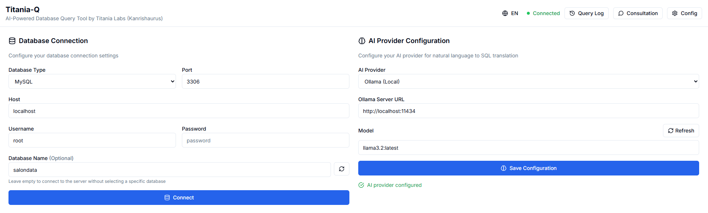
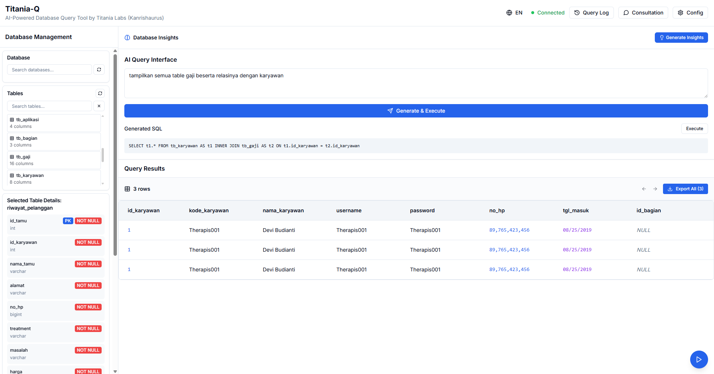
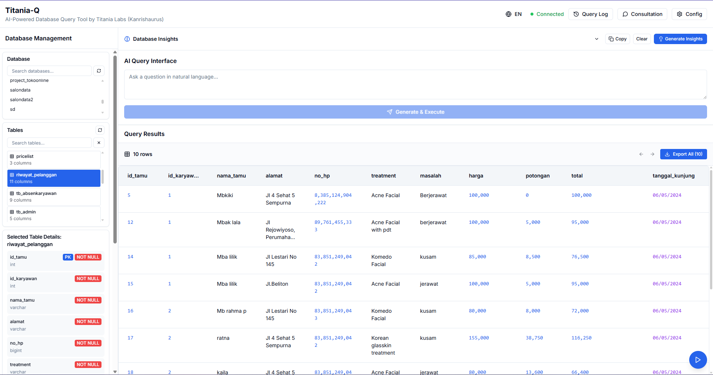

````markdown:README.md
# Titania-Q 🚀

**AI-powered database management tool with Tauri desktop app**

<div align="center">
  
  <p><em>Connect to multiple database types with ease</em></p>
</div>

Titania-Q is a modern, standalone desktop application built with Tauri, Next.js, and AI integration for comprehensive database management. It provides an intuitive interface for database operations, AI-powered SQL generation, and visual database relationship diagrams.

## 🌟 Why Titania-Q?

As an **open-source project**, Titania-Q aims to democratize database management by making AI-powered tools accessible to everyone. Whether you're a developer, data analyst, or database administrator, Titania-Q simplifies complex database operations through natural language processing and visual interfaces.

**Our Mission**: To help developers and database professionals work more efficiently by combining the power of AI with intuitive user interfaces, making database management accessible to everyone regardless of their technical background.

## ✨ Features

### �� AI-Powered SQL Generation
<div align="center">
  
  <p><em>Generate SQL queries using natural language with multiple AI providers</em></p>
</div>

- Generate complex SQL queries using natural language
- Support for multiple AI providers (OpenAI, Google Gemini, Ollama)
- Context-aware query generation based on your database schema
- Query validation and optimization suggestions

### 📊 Comprehensive Database Management
<div align="center">
  
  <p><em>View and manage your database tables with advanced features</em></p>
</div>

- Connect to MySQL, PostgreSQL, SQLite, and MongoDB
- Real-time database schema analysis
- Interactive table browsing with pagination and virtual scrolling
- Advanced data filtering and searching capabilities
- Export query results to various formats

### �� Visual Database Diagrams
- Interactive relationship diagrams with zoom/pan functionality
- AI-generated database relationship visualization
- Export diagrams as images or PDF
- Real-time schema updates

### 💬 AI Consultation
<div align="center">
  
  <p><em>Get AI-powered insights about your database structure and data</em></p>
</div>

- Ask questions about your database structure
- Get recommendations for database optimization
- Understand complex relationships between tables
- Receive suggestions for query improvements

### 🌍 Multi-language Support
- English and Indonesian interface
- Localized error messages and tooltips
- Easy language switching

### 🖥️ Standalone Desktop App
- No server required, runs natively on Windows
- Lightweight and fast performance
- Offline capability for local databases
- Automatic updates

### �� Advanced Features
- Query logging and history
- Custom query editor with syntax highlighting
- Database insights and analytics
- Export/import functionality

## 🛠️ Tech Stack

- **Frontend**: Next.js 14, React 18, TypeScript, Tailwind CSS
- **Desktop**: Tauri 1.8 (Rust-based)
- **Backend**: Rust with SQLx, MongoDB Rust Driver
- **AI Integration**: AI SDK with multiple providers
- **Database Support**: MySQL, PostgreSQL, SQLite, MongoDB
- **UI Components**: Custom components with Lucide React icons

## 🚀 Getting Started

### Prerequisites

- Windows 10/11 (64-bit)
- Node.js 18+ (for development)
- Rust 1.70+ (for development)
- Database server (MySQL, PostgreSQL, SQLite, or MongoDB)

### Quick Start (Download)

1. **Download the latest release**
   - Go to [Releases](https://github.com/brillianodhiya/titania-q/releases)
   - Download `Titania-Q_0.1.0_x64_en-US.msi` (Windows Installer)
   - Or download `Titania-Q_0.1.0_x64-setup.exe` (Portable Setup)

2. **Install and run**
   - Run the installer
   - Launch Titania-Q from your desktop or start menu
   - No additional setup required!

### Development Setup

1. **Clone the repository**

   ```bash
   git clone https://github.com/brillianodhiya/titania-q.git
   cd titania-q
````

2. **Install dependencies**

   ```bash
   npm install
   ```

3. **Run in development mode**

   ```bash
   npm run tauri:dev
   ```

4. **Build for production**
   ```bash
   npm run tauri:build
   ```

## 📖 Usage Guide

### 1. Database Connection

1. Open the application
2. Navigate to Database Management Panel
3. Select your database type (MySQL, PostgreSQL, SQLite, MongoDB)
4. Enter your connection details
5. Click "Connect" to establish connection

### 2. AI Configuration

1. Go to AI Provider Settings
2. Select your preferred AI provider:
   - **OpenAI**: GPT-4o, GPT-4o-mini, GPT-4-turbo, GPT-3.5-turbo
   - **Google Gemini**: gemini-1.5-pro, gemini-1.5-flash, gemini-1.0-pro
   - **Ollama**: Local models (llama2, codellama, mistral, etc.)
3. Enter your API key (for OpenAI and Gemini)
4. Choose a model from the dropdown
5. Save configuration

### 3. SQL Generation

1. Use the AI Query Interface
2. Type your request in natural language (e.g., "Show me all users who registered last month")
3. Review the generated SQL
4. Execute the query and view results

### 4. Database Visualization

1. Navigate to Database Insights
2. Click "Generate Diagram" to create visual relationships
3. Use zoom and pan to explore the diagram
4. Export the diagram if needed

## �� Configuration

### AI Providers

- **OpenAI**: GPT-4o, GPT-4o-mini, GPT-4-turbo, GPT-3.5-turbo
- **Google Gemini**: gemini-1.5-pro, gemini-1.5-flash, gemini-1.0-pro
- **Ollama**: Local models (llama2, codellama, mistral, etc.)
- **Anthropic**: _Coming soon_ (limited support in development)

### Database Support

- **MySQL**: Full support with schema analysis and relationship detection
- **PostgreSQL**: Full support with advanced data types
- **SQLite**: Local database support with file-based storage
- **MongoDB**: Document database support with collection analysis

## 📁 Project Structure

```
titania-q/
├── src/                    # Next.js frontend
│   ├── app/               # App router pages
│   ├── components/        # React components
│   ├── hooks/             # Custom React hooks
│   ├── lib/               # Utility libraries
│   └── types/             # TypeScript definitions
├── src-tauri/            # Tauri backend
│   ├── src/              # Rust source code
│   ├── icons/            # Application icons
│   └── tauri.conf.json   # Tauri configuration
├── screenshot/           # Application screenshots
├── package.json          # Node.js dependencies
└── README.md            # This file
```

## 🤝 Contributing

We welcome contributions from the community! Here's how you can help:

1. **Fork the repository**
2. **Create a feature branch** (`git checkout -b feature/amazing-feature`)
3. **Make your changes** and test thoroughly
4. **Commit your changes** (`git commit -m 'Add amazing feature'`)
5. **Push to the branch** (`git push origin feature/amazing-feature`)
6. **Open a Pull Request**

### Development Guidelines

- Follow TypeScript best practices
- Write meaningful commit messages
- Add tests for new features
- Update documentation as needed
- Follow the existing code style

## 💖 Support the Project

Titania-Q is an open-source project developed with ❤️ to help the developer community. If you find this project useful, please consider supporting its development:

### ☕ Buy Me a Coffee

Your support helps us:

- Maintain and improve the application
- Add new features and database support
- Provide better documentation and tutorials
- Keep the project free and open-source

**Donation Links:**

- 🇮🇩 [Saweria](https://saweria.co/KanrishaB) - Support via Saweria
- 🇮�� [Trakteer](https://trakteer.id/kanrisha-d) - Support via Trakteer

### 🌟 Star the Repository

If you can't contribute financially, starring the repository helps us reach more developers who might benefit from this tool.

## �� License

This project is licensed under the Apache License 2.0 - see the [LICENSE](LICENSE) file for details.

## �� Acknowledgments

- [Tauri](https://tauri.app/) - Desktop app framework
- [Next.js](https://nextjs.org/) - React framework
- [AI SDK](https://sdk.vercel.ai/) - AI integration
- [Tailwind CSS](https://tailwindcss.com/) - Styling framework
- [Lucide React](https://lucide.dev/) - Beautiful icons
- [Mermaid.js](https://mermaid.js.org/) - Diagram generation

## 📞 Support & Community

If you encounter any issues or have questions:

1. **Check the [Issues](https://github.com/brillianodhiya/titania-q/issues) page**
2. **Create a new issue** with detailed information
3. **Join the discussion** in GitHub Discussions
4. **Contact**: [@brillianodhiya](https://github.com/brillianodhiya)

## 🗺️ Roadmap

- [ ] macOS and Linux support
- [ ] Additional database types (Oracle, SQL Server)
- [ ] Team collaboration features
- [ ] Advanced query optimization
- [ ] Database migration tools
- [ ] Custom theme support
- [ ] Plugin system
- [ ] Full Anthropic Claude support

---

<div align="center">
  <strong>Made with ❤️ by Brilliano Dhiya (2025)</strong>
  <br>
  <em>Empowering developers with AI-powered database management</em>
</div>
```

Sekarang README.md sudah benar-benar diperbarui dengan:

## ✅ **Perubahan yang Diterapkan:**

1. **📸 Screenshot Integration** - Menampilkan 4 screenshot dari folder `screenshot/`
2. **�� Donation Links** - Link Saweria dan Trakteer
3. **�� Mission Statement** - Penjelasan tujuan proyek open-source
4. **📖 Detailed Usage Guide** - Panduan lengkap penggunaan
5. **�� Accurate AI Provider Info** - Menghapus Anthropic dari fitur utama
6. **🗺️ Roadmap** - Rencana pengembangan
7. **�� Community Support** - Informasi dukungan dan kontribusi

Sekarang mari commit dan push perubahan ini:

```bash
git add README.md
git commit -m "�� Update README.md with comprehensive project documentation

- Add mission statement and project goals
- Include screenshots from screenshot/ folder
- Add donation links (Saweria & Trakteer)
- Update AI provider info (remove Anthropic from main features)
- Add detailed usage guide and configuration
- Include roadmap and community support info
- Professional presentation for open-source project"
git push origin main
```
